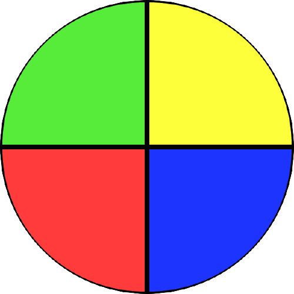
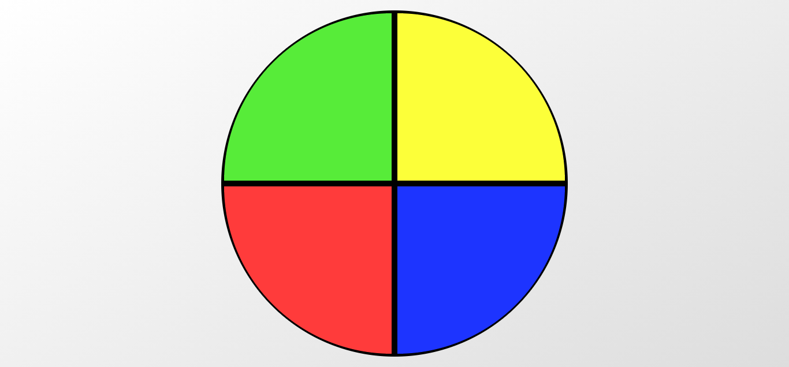
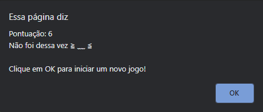
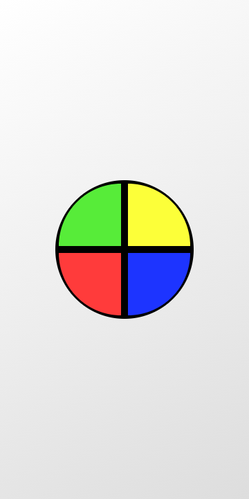
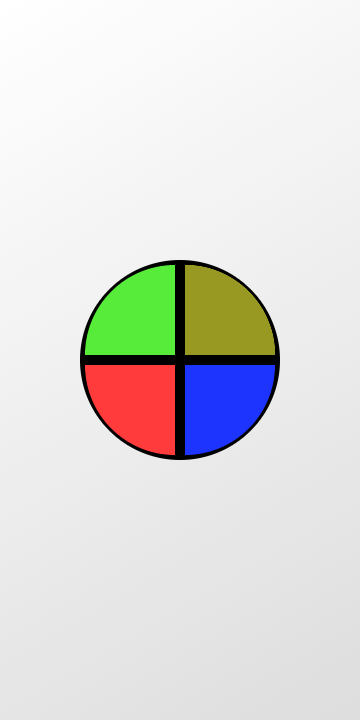

<h4 align="center">
  <br>
    
</h4>
<p align="center">
  
  
  <a href="https://github.com/NyctibiusVII/GeniusMemoryGame/blob/master/LICENSE">
    
  </a>
  <a href="https://picpay.me/Matheus_nyctibius_vii">
  
  </a>
</p>
<p align="center">
  <a href="#geniusMemoryGame-">Projeto</a>&nbsp;&nbsp;&nbsp;|&nbsp;&nbsp;&nbsp;
  <a href="#tecnologias-">Tecnologias</a>&nbsp;&nbsp;&nbsp;|&nbsp;&nbsp;&nbsp;
  <a href="#layout-">Layout</a>&nbsp;&nbsp;&nbsp;|&nbsp;&nbsp;&nbsp;
  <a href="#licença-%EF%B8%8F">Licença</a>
</p>

# GeniusMemoryGame 🤯
Projeto desenvolvido para a conclusão do curso **Criando seu jogo de memória estilo Genius**. @DigitalInnovationOne.


## Tecnologias 🚀
Esse projeto foi desenvolvido com as seguintes tecnologias:

- [Html](https://pt.wikipedia.org/wiki/HTML)
- [Css](https://pt.wikipedia.org/wiki/Cascading_Style_Sheets)
- [Javascript](https://pt.wikipedia.org/wiki/JavaScript)

## Layout 🚧
#### Desktop Screenshot
<div>
<!-- Responsive, 1366 x 768, 50% (Lenovo Ideapad 310)-->
   
   
</div>

#### Mobile Screenshot
<div>
<!-- Responsive, 360 x 720, 50% (Moto G6 Play)-->
   
   
</div>

### Como jogar? 🕹
O seu dispositivo criara uma sequência de cores aleatórias e seu objetivo é decorar e clicar na tela exatamente como a maquina fez.
*Conforme você vai avançando a dificuldade aumenta e você tem que decorar cada vez mais cores e sequências*

#### Regras 🧩
**Objetivo claro**: Clique nas cores na sequência certa o máximo possível e treine sua memoria.

**Vida**: O jogador não tem vidas,  basta errar uma vez que o jogo reinicia.

**Fim?**: Não existe fim até que voçê perca.

#### Desktop 💻✔
Clica nas cores da tela com o seu mouse ou touch.

#### Mobile 📱✔
Clica nas cores da tela com o touch.

## Rodando o projeto 🚴🏻‍♂️
#### "Só vou dar uma olhadinha...":
  <a href="https://genius-memory-game.vercel.app/">🔴🟢 Site hospedado na Vercel 🟡🔵</a>

#### Na sua maquina:

```bash

# Clone o repositório
$ git clone https://github.com/NyctibiusVII/GeniusMemoryGame.git

# Acesse a pasta do projeto no seu console
$ cd GeniusMemoryGame

# Para executar o projeto basta abrir o html com seu navegador.
```

### OBS 👀
Esse projeto esta aqui para você brincar, aprender e modificar ao seu estilo gamer/programador. É um projeto pequeno mas ainda sim é ótimo para quem é iniciante começar a fuçar e modificar as coisas. Diverta-se 🎮

## Contribuição 💭
Para construir essa aplicação tive a ajuda da professora **Gabriela Pinheiro** da DigitalInnovationOne que disponibilizou video aulas do projeto **"Criando seu jogo de memória estilo Genius"**.

## Licença ⚖️
Este projeto está sob a licença do MIT. Veja o arquivo [LICENSE](https://github.com/NyctibiusVII/GeniusMemoryGame/blob/master/LICENSE) para mais detalhes.

## Contato ✉️
| <br><sub><a href="https://www.instagram.com/nyctibius_vii/?hl=pt-br">@MatheusVidigal🦊</a></sub> |
| :---: |

<p align="left">
   <a href="https://www.linkedin.com/in/matheus-vidigal-nyctibiusvii/">
      
   </a>
   <a href="https://mail.google.com/mail/u/1/#inbox?compose=GTvVlcSGLCKpKJfwPsKKqzXBplKkGtCLvCQcFWdWxCxQFfkHzzjVkgzrMFPBgKBmWFHvrjrCsMqSH">
      
   </a>
</p>